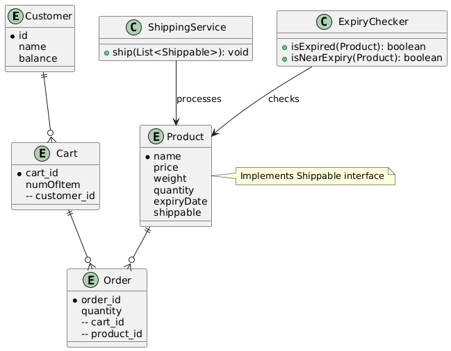
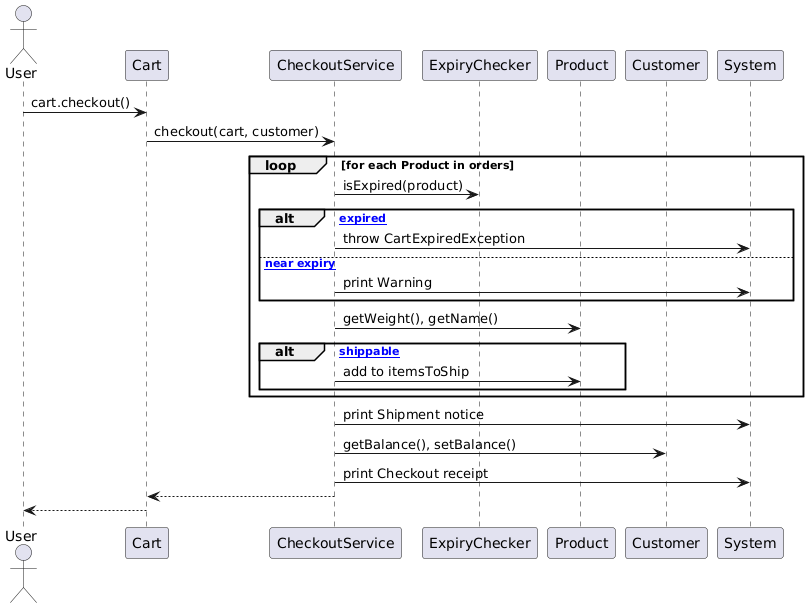
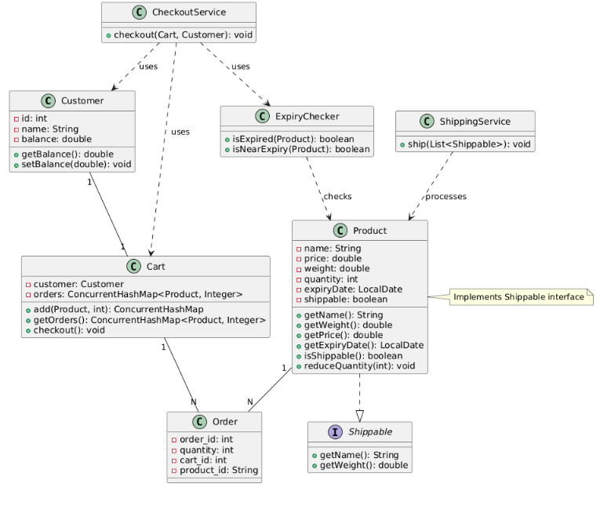

# 🛒 Simple E-Commerce Checkout System

A lightweight Java-based console application that simulates the core functionality of an e-commerce checkout system. It includes product management, expiry date handling, cart operations, shipping calculations, and customer balance tracking.

---

## 🚀 Features

- Add products to a cart with quantity validation.
- Auto-calculate subtotal, shipping fees, and total.
- Track and deduct customer balance.
- Handle product expiry with real date validation (`LocalDate`).
- Identify shippable items and calculate total package weight.
- Clear, formatted console outputs for receipts and shipment notes.

---

## 👨‍💻 Technologies

- Java 17+
- OOP Principles
- `java.time.LocalDate` for expiry handling
- Clean architecture (Separation of Concerns)

---
## 🧭 Diagrams

### 📊 Entity Relationship Diagram (ERD)

Illustrates relationships between main entities: `Product`, `Customer`, `Cart`, and `CheckoutService`.



---

### 🔄 Activity Diagram

Visual representation of the main checkout process: from adding products to calculating fees and handling expiry.



---

### 📦 Class Diagram

Overview of the system’s class structure and interactions.




## 📌 How to Run

1. Clone the repository:
   ```bash
   git clone https://github.com/YOUR_USERNAME/YOUR_REPO_NAME.git
   cd YOUR_REPO_NAME
